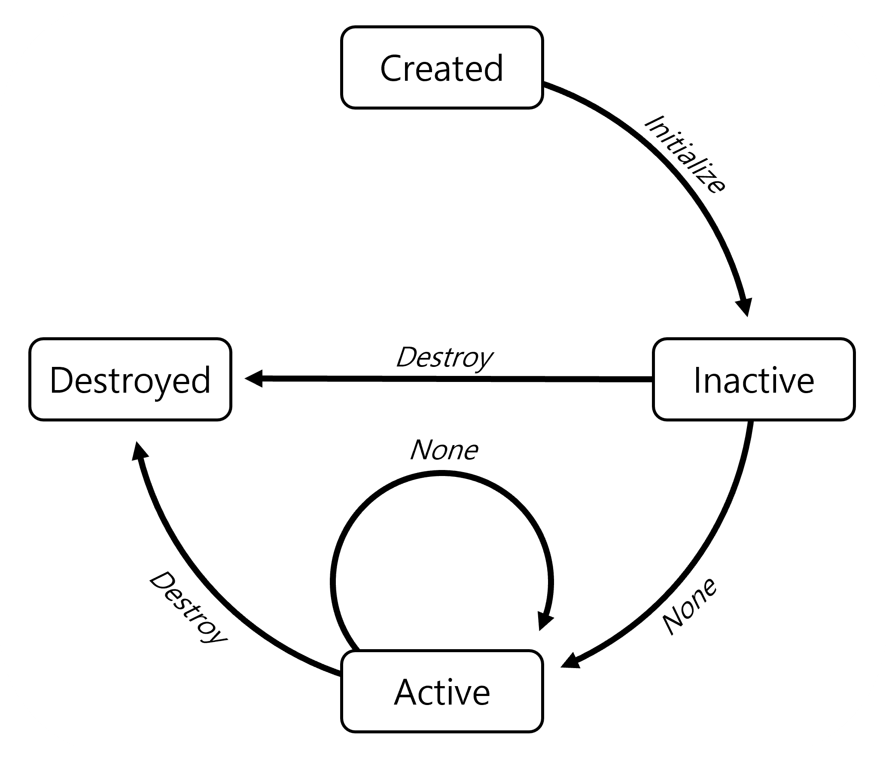

# Unity Modularization

## 목적

'어떤 Unity Project를 시작하든, 공통적으로 사용할 수 있는 모듈이 있으면 어떨까?' 혹은, '특정 모듈 패키지를 배포하는 입장에서, 서비스 제작자 입맛에 맞게 선택하여 사용할 수 있으면 어떨까?'의 생각에서 나온 프로젝트.

## 구성

### IScriptFoundation

패키지의 Identity를 담당하는 인터페이스.

### ScriptableObjectFoundation

ScriptableObject내 Setting을 선행적으로 주입하기 위한 클래스. Awake 사이클에서 Setting 관련 정보를 주입합니다.

### MonoBehaviourFoundation

MonoBehaviour내 Setting을 선행적으로 주입하기 위한 클래스. Awake 사이클에서 Setting 관련 정보를 주입합니다.

### BaseFoundation

일반 클래스내 Setting을 선행적으로 주입하기 위한 클래스. 생성자에서 Setting 관련 정보를 주입합니다.

### ModuleManager

Module을 관리하는 MonoBehaviour이며, Singleton 형태. Scene마다 다른 형태의 Module 사용을 고려해, `DontDestroyOnLoad` 형태를 배제하였음.

별도의 EditorCode가 존재하며, Inspector에서 모든 Module을 호출하여 관리할 수 있습니다.

### ModuleFoundation

ModuleManager에 속하게 될 Module의 기본 구성이며, `ScriptableObjectFoundation`과 `IScriptFoundation`를 상속받습니다. 이들의 State Machine은 아래와 같이 구성됩니다.



Unity Update 라이프 사이클에 이벤트를 태울 수 있도록, 각 Module별로 독립적인 Queue를 소유하고 있습니다. ModuleManager는 각 Module들의 Queue에서 이벤트를 발행토록 합니다.

### SettingModuleManager

패키지의 Module의 Setting을 관할하는 `Module`입니다. ModuleFoundation을 상속받아 구현되었으며, 다른 Module들과 동등한 수준이기에, Module의 초기화 과정에서 가장 먼저 초기화 절차를 밟습니다.

#### SettingAttribute

Attribute 형태로 각 멤버 변수에 Setting을 지정할 수 있습니다. 정상적인 Setting 사용을 위해서는 BaseFoundation (기본 클래스), MonoBehaviourFoundation (MonoBehaviour 기본 클래스), 그리고 ScriptableObjectFoundtaion (ScriptableObject 기본 클래스)를 상속 받아야 합니다.

Setting은 Editor내에서 직접 수정이 가능하고 (UnityModularization/Setting Module Editor), Runtime내에서 값을 동적으로 수정할 수 있습니다.

더불어, 이에 대한 구독 이벤트도 존재합니다.

```csharp
[Bool(name: "BoolValue", tag: "ExampleE", true)] bool boolValue;

public void ChangeBoolValue()
{
    SettingModuleManager settingModuleManager = ModuleManager.Instance.GetModule("SettingModuleManager") as SettingModuleManager;
    settingModuleManager.AddUpdateEvent("BoolValue", (pre, post) => OnChangedBoolValue((bool) pre, (bool) post));
    settingModuleManager.UpdateSetting("BoolValue", false);
}

public void OnChangedBoolValue(bool pre, bool post)
{
    UnityEngine.Debug.Log($"OnChangedBoolValue : {pre} => {post}");
}
```

#### Setting.json

Setting 정보를 읽고 쓰는 Json 파일입니다. 기본 디렉토리는 `Assets/Resources/UnityModularization` 입니다.

## 예제

*Tests의 TestRunner와 Scenes 참고*